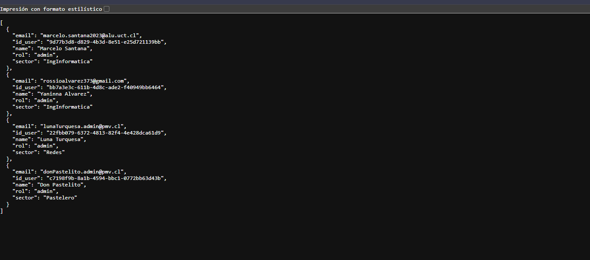
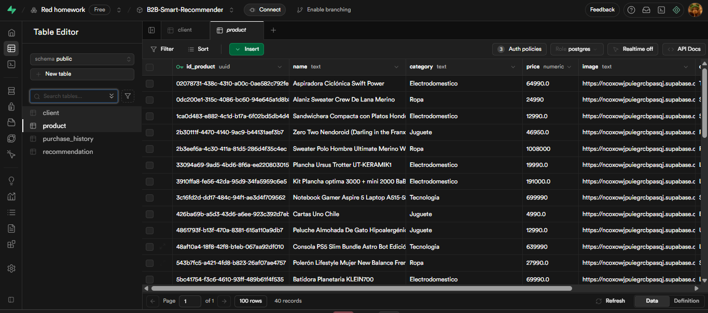
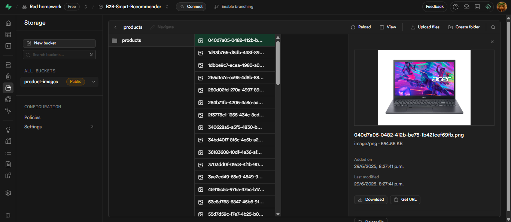
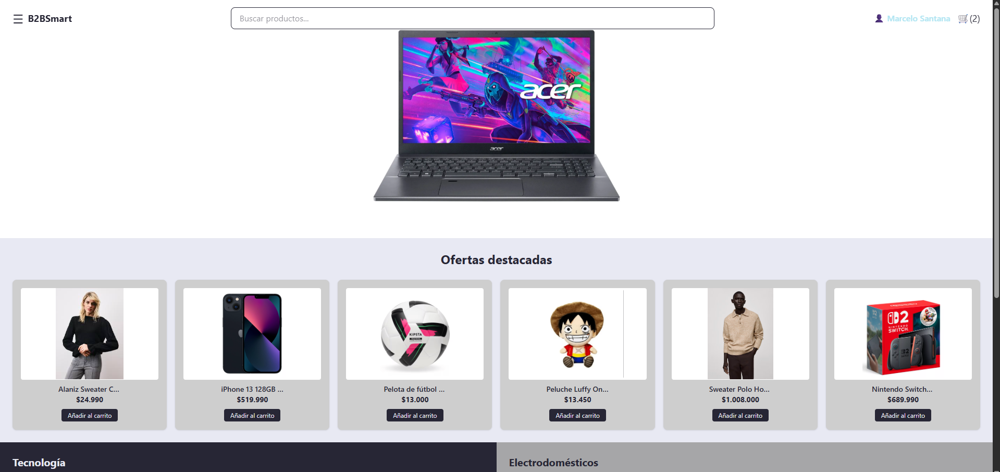

# Trabajando en la app  B2B-Smart-Recommender
Backend 
- Desarrollo de la API REST con 
Flask. 
- Gestión de la base de datos en 
PostgreSQL. 
- Insertar datos en la BD
- Integración de 
recomendaciones en frontend 
- Tests iniciales y 
ajustes  

> Semana3: Backend básico (API para productos y clientes) 

> Semana4: Integración de recomendaciones en frontend -  Mejoras de api.

## INFO del proyecto:
Estructura general del proyecto →
```
/b2bsmart              <-- frontend
/Backend               <-- backend [Área de trabajo]
/Parte_del-backend     <-- Arch posteriores
```

###  Backend en desarrollo - API (Flask)

En este proyecto trabajamos con **Flask** para crear una API básica de productos y clientes.

```
Backend/
│
├── __pycache__/              ← Archivos temporales generados por Python
│
├── routes/                   ←  Rutas de la API organizadas por recurso
│   ├── __pycache__/          ←  Caché de Python
│   ├── clientes.py           ←  Define endpoints relacionados a clientes
│   └── productos.py          ←  Define endpoints relacionados a productos
│
├── venv/                     ←  Entorno virtual de Python(no subido)
├── .env                      ←  Variables de entorno para conectar
│
├── app.py                    ←  Ejecutar y ver si funciona todo
│
├── db.py                     ←  Configuración de la base de datos y conexión 
│
├── models.py                 ←  Define los modelos de datos
│
├── requirements.txt          ←  Lista de dependencias de Python para instalar el entorno con `pip install -r`

```
### Captura de funcionamiento de API

Datos registrados del client




## Supabase 

### Base de datos - productos

En nuestras BD la tabla `client` y `product` se le insertaron datos, mediante la `API`.

Acá se muestra los datos insertados en la BD, esta tiene un campo que almacena la ruta de la imagen en una carpeta de `Store` de supabase.



### Base de datos - Storage (productos)


### Como resultado de Backend(API) + Fronted

