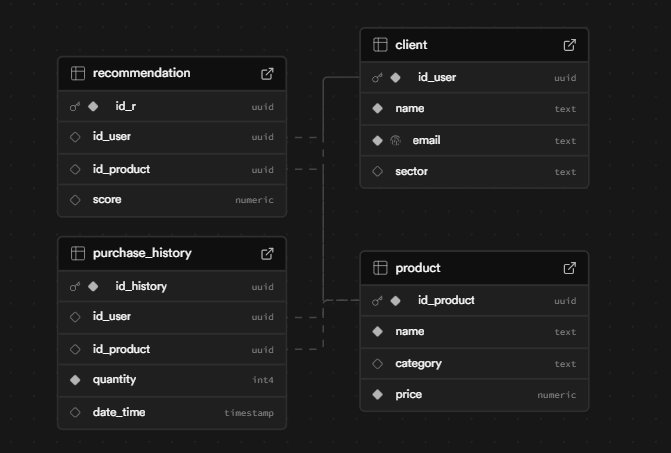
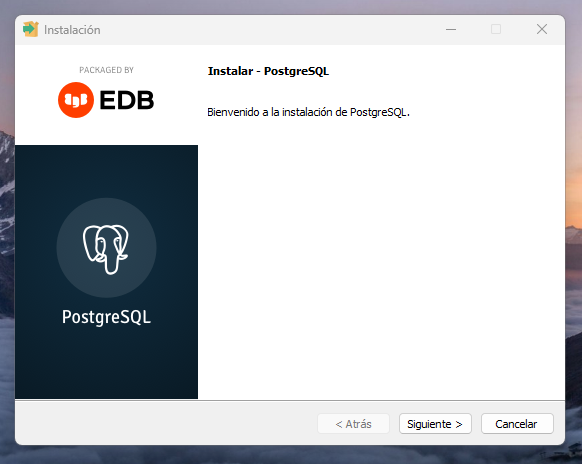
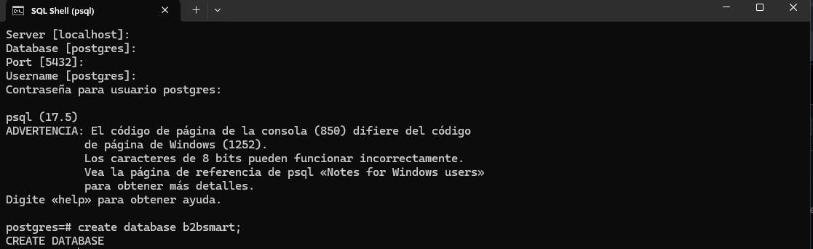
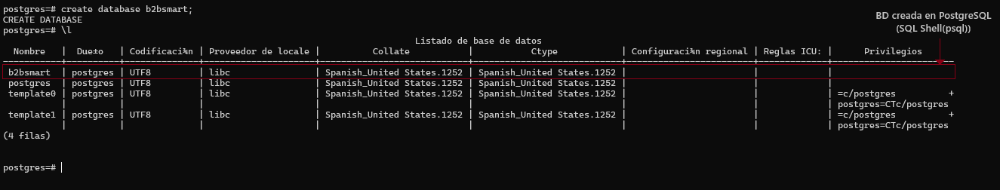
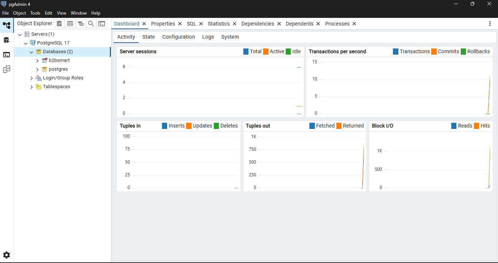
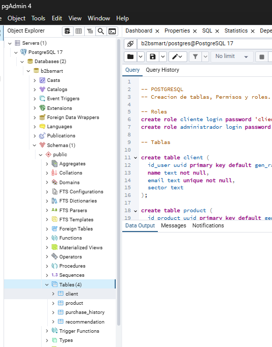

## Trabajo realizado en la app - B2B Smart Recommender

En esta rama muestro mi trabajo y mis tareas:

- Instanciar las tablas y permisos en Supabase.  
- Implementar código con sintaxis SQL en Supabase y PostgreSQL.  
- Instalar las herramientas de PostgreSQL.  
- Usar consola y la interfaz gráfica para crear tablas (psql y pgAdmin 4).

## Capturas

<table border="1" cellspacing="10" cellpadding="10" style="width: 100%; text-align: center;">
  <tr>
    <td>
      
      
<i>Tablas instanciadas con sus permisos de lectura, inserción y actualización → Supabase</i>

    </td>
    <td>
      
      
<i>Instalar PostgreSQL</i>

    </td>
  </tr>
  <tr>
    <td>
      
      
<i>Comprobar y usar consola SQL Shell (psql)</i>

    </td>
    <td>
      
      
<i>Crear base de datos b2bsmart (se encuentran otras por defecto)</i>

    </td>
  </tr>
  <tr>
    <td>
      
      
<i>Iniciar pgAdmin 4</i>

    </td>
    <td>
      
      
<i>Se insertó el código SQL, creando así las tablas listas para usarse.</i>

    </td>
  </tr>
</table>
